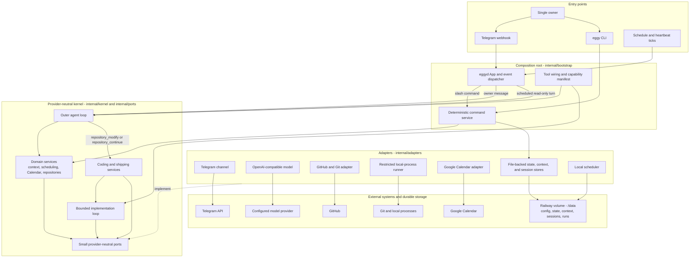

# Eggy architecture

Eggy is a single-user personal agent that runs continuously on Railway and is
reachable through Telegram, with a companion `eggy` CLI reading the same
files. It is a Go ports-and-adapters modular monolith with file-backed state,
supporting exactly one owner and one `eggyd` replica.

For durable decisions this document doesn't re-argue, see [`docs/adr/`](adr/).
For operator-facing setup and commands, see [`README.md`](../README.md).

## Architectural style

The kernel (`internal/kernel`, `internal/ports`) contains domain types and
use-case orchestration only. It does not import Telegram, model-provider,
GitHub, Google, YAML, JSON-file persistence, Docker, or Railway packages.
Provider implementations sit behind small interfaces owned by the kernel;
`internal/bootstrap` is the only package that constructs adapters, validates
capabilities, and wires them into kernel services. Adding a provider (model
backend, chat channel, repository host, calendar backend) means adding a
package under `internal/adapters/<category>/<provider>/` plus wiring in
bootstrap — never a kernel or port change. See `AGENTS.md` for the concrete
steps.



Solid arrows show runtime calls and message flow. The dotted adapter-to-port
arrow shows dependency inversion: kernel code depends on ports, while adapters
implement those ports and are selected only by bootstrap. Direct commands and
deterministic scheduled messages skip the model loop; scheduled agent turns
and heartbeat turns enter the outer loop with a restricted tool set and no
ambient conversation history; repository modifications enter the separate
bounded implementation loop.

## The agent loop

One tool-calling loop (`internal/kernel/agent.Loop`) handles every owner
turn — conversation, Calendar, scheduling, and repository work alike. There
is no separate "coding model" or CLI subprocess. Deterministic slash commands
(`/status`, `/model`, `/config`, ...) and a schedule created with
`ports.ScheduleExecutionMessage` (a reminder or watchdog-style notification)
bypass the model entirely, the latter delivering its instruction text
verbatim. Everything else enters the loop with the selected model alias, the
tools available for that message's source, current runtime capabilities, and
durable context (`SOUL.md`, `USER.md`, `MEMORY.md`).

Direct owner Telegram messages additionally see recent conversation history
and get the full tool set, including `repository_modify` and
`repository_continue`. Scheduled agent turns and heartbeat turns are
self-contained instead: no ambient recent-conversation history (so an old
chat instruction cannot be silently revived) and an explicit read-only
allowlist — they can never start or resume an implementation run. A
heartbeat turn additionally sees the owner-editable `HEARTBEAT.md` checklist
and is skipped entirely, with no model call, while an implementation run is
active; silent `USER.md`/`MEMORY.md` curation on a heartbeat turn is never
gated by quiet hours or the weekly proactive-message limit, only the
Telegram check-in itself is. See [ADR 0001](adr/0001-single-configured-model.md)
for why there is exactly one selected model with no automatic escalation, and
[ADR 0002](adr/0002-native-implementation-loop.md) for why repository edits
run as tool calls in this same loop instead of a delegated coding-agent CLI.

### Repository tools

- `repository_list` — configured repository names and safe metadata.
- `repository_github` — read-only GitHub issue/PR/check-run metadata.
- `read_file`, `terminal` — bounded read/shell access. Outside a
  `repository_modify` run these operate against an ephemeral, read-only
  checkout that's destroyed after the turn: no branch, no diff, no approval.
- `repository_modify` — starts a bounded implementation run (see below).
- `repository_continue` — resumes a named or most-recent resumable
  implementation session.

Inside an active `repository_modify` run, a second, bounded `Loop` gets three
additional tools that are never registered outside that run: `patch` (exact
old-string → new-string replacement), `write_file` (create or overwrite), and
`finish_implementation` (the required structured terminal call:
`{summary, validation, commit_message, changed_files}`).

## Implementation runs and durable sessions

A `repository_modify` call: clones the configured base branch, creates
`eggy/<run-id>`, loads root `AGENTS.md`, runs the inner loop, captures the
diff and validation evidence, then requests commit approval. The workspace
lives under the configured `runner.root`, which must be on the durable
Railway volume (e.g. `/data/runs`) for a session to survive a restart.

Each run is backed by a durable implementation session under
`/data/sessions/<session-id>/` — separate from `/data/state.json` so the
core state schema needs no migration for it:

```text
/data/sessions/<session-id>/
  session.json   # task, repository, branch, workspace, status, timestamps
  events.jsonl   # append-only transcript and concise semantic events
  context.json   # compaction checkpoint plus retained recent context
```

The session store is the source of truth for agent history, checkpoints, and
resumability; `CodingRun` in `state.json` remains the source of truth for the
commit/push/PR lifecycle, using the session ID as its run ID.

Resumption is explicit only: the owner asks Eggy to continue a run, never the
reverse. On restart, a session persisted as `running` is marked
`interrupted` and is never auto-resumed. If a resumed run changes the diff,
the prior commit approval is invalidated and a fresh one is required. Before
a model call would exceed the configured context budget, Eggy checkpoints
the objective, decisions, inspected/changed files, validations, and blockers,
and the next call receives that checkpoint plus the recent transcript tail
instead of the full history. Telegram renders concise semantic milestones
(`Plan: ...`, `Edited: ...`, `Validation: ...`), not raw tool-call noise.

## Shipping and authorization

Commit, push, and pull-request creation each still require their own
independent, expiring, payload-digest-bound approval — but `ShippingService`
decides each one automatically in sequence instead of waiting for an owner
Telegram tap. See [ADR 0003](adr/0003-automatic-shipping-authorization.md)
for why, and for exactly what stayed the same.

Unchanged regardless of automatic decision:

- A changed diff, branch, or commit invalidates the pending approval
  (`ApprovalService.Authorize` checks the payload digest).
- Local and remote HEAD are revalidated immediately before push and before
  pull-request creation.
- Protected branches are denied at push time even with an approved payload.
- Eggy never merges a pull request.

Calendar create/update/delete still requires an explicit owner tap in
Telegram — that approval path is unchanged. Repository registration
(`add_repository`) is the other action that still waits for an explicit
owner decision rather than deciding itself.

## Models and providers

Version 2 configuration defines named OpenAI-compatible providers and named
model aliases; `agent.default_model` picks the default, and the owner can
inspect or override it with `/model`. Provider request/response types,
authorization, and usage parsing stay inside the model adapter — the kernel
only depends on `ports.Model`. Version 1 configuration (a single DeepSeek
Flash/Pro pair) still loads and is mapped to an implicit single alias; it
does not gain access to the escalation behavior that alias name might imply,
because that behavior no longer exists (ADR 0001).

## Telegram and CLI surfaces

Telegram is the primary channel: webhook signature and owner-ID verification,
update deduplication, HTML replies with plain-text fallback, and in-place
message edits for approval outcomes and run progress. The `eggy` CLI reads
the same `config.yaml`/`state.json`/session files for local/offline
inspection and `config` management without constructing the full runtime.

Both surfaces share one command set: `/status`, `/repositories`, `/runs`,
`/continue [run-id] [instruction...]`, `/stop <run-id>`, `/schedules`,
`/memory`, `/clear`, `/model [alias|default]`, `/config get|set ...`,
`/usage [reset]`, `/calendar_auth`, and `/restart`. `/restart` triggers a
self-exec-in-place process restart to pick up an edited `config.yaml`/`.env`
without an external supervisor — see
[ADR 0004](adr/0004-self-exec-in-place-restart.md).

## Safety invariants

These hold regardless of what else changes in the kernel or an adapter:

- `internal/kernel` and `internal/ports` stay provider-neutral; adapters
  register only through `internal/bootstrap`.
- File locking and atomic writes for config, state, context, and session
  persistence.
- Telegram webhook authentication, owner allowlisting, update deduplication.
- Runner root restriction, path validation, environment allowlisting,
  timeout/output bounds, process-group cancellation, workspace cleanup.
- Active-secret filtering and secret-like content rejection before any
  `USER.md`/`MEMORY.md` write.
- Calendar mutation approvals, OAuth refresh-token encryption, idempotent
  creates, ETag-bound updates/deletes.
- Independent commit, push, and pull-request authorization with
  protected-branch denial, whether decided by an owner tap or automatically.
- Scheduled and heartbeat turns cannot reach `repository_modify` or
  `repository_continue`.
- Exactly one `eggyd` replica while operational state is file-backed.
