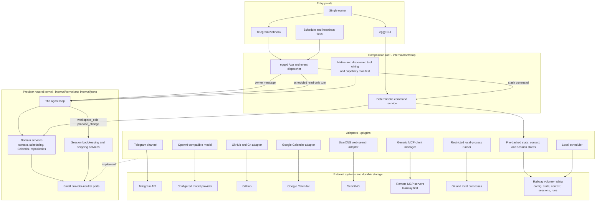

# Eggy architecture

Eggy is a single-user personal agent that runs continuously on Railway and is
reachable through Telegram, with a companion `eggy` CLI reading the same
files. It is a Go ports-and-adapters modular monolith with file-backed state,
supporting exactly one owner and one `eggyd` replica.

For operator-facing setup and commands, see [`README.md`](../README.md).

## Architectural style

The kernel (`internal/kernel`, `internal/ports`) contains domain types and
use-case orchestration only. It does not import Telegram, model-provider,
GitHub, Google, YAML, JSON-file persistence, Docker, or Railway packages.
Provider implementations sit behind small interfaces owned by the kernel;
`internal/bootstrap` is the only package that constructs adapters, validates
capabilities, and wires them into kernel services. Adding a provider (model
backend, chat channel, repository host, calendar backend) means adding a
package under `plugins/<category>/<provider>/` plus wiring in
bootstrap — never a kernel or port change. See `AGENTS.md` for the concrete
steps.


```mermaid
flowchart TB
    subgraph entry[Entry points]
        owner[Single owner]
        telegram[Telegram webhook]
        cli[eggy CLI]
        clock[Schedule and heartbeat ticks]

        owner --> telegram
        owner --> cli
    end

    subgraph composition[Composition root - internal/bootstrap]
        daemon[eggyd App and event dispatcher]
        commands[Deterministic command service]
        registry[Native and discovered tool wiring<br/>and capability manifest]
    end

    telegram --> daemon
    clock --> daemon
    cli --> commands
    daemon -->|slash command| commands

    subgraph kernel[Provider-neutral kernel - internal/kernel and internal/ports]
        outer[The agent loop]
        services[Domain services<br/>context, scheduling, Calendar, repositories]
        coding[Session bookkeeping and shipping services]
        ports[Small provider-neutral ports]

        outer --> services
        outer -->|workspace_edit, propose_change| coding
        services --> ports
        coding --> ports
    end

    daemon -->|owner message| outer
    daemon -->|scheduled read-only turn| outer
    commands --> services
    registry --> outer

    subgraph adapters[Adapters - /plugins]
        channelAdapter[Telegram channel]
        modelAdapter[OpenAI-compatible model]
        repositoryAdapter[GitHub and Git adapter]
        runnerAdapter[Restricted local-process runner]
        calendarAdapter[Google Calendar adapter]
        searchAdapter[SearXNG web-search adapter]
        mcpAdapter[Generic MCP client manager]
        stores[File-backed state, context, and session stores]
        schedulerAdapter[Local scheduler]
    end

    adapters -. implement .-> ports
    commands --> stores

    subgraph systems[External systems and durable storage]
        telegramAPI[Telegram API]
        modelAPI[Configured model provider]
        github[GitHub]
        google[Google Calendar]
        searxng[SearXNG]
        mcpServers[Remote MCP servers<br/>Railway first]
        process[Git and local processes]
        data[Railway volume - /data<br/>config, state, context, sessions, runs]
    end

    channelAdapter --> telegramAPI
    modelAdapter --> modelAPI
    repositoryAdapter --> github
    runnerAdapter --> process
    calendarAdapter --> google
    searchAdapter --> searxng
    mcpAdapter --> mcpServers
    stores --> data
    schedulerAdapter --> data
```

Solid arrows show runtime calls and message flow. The dotted adapter-to-port
arrow shows dependency inversion: kernel code depends on ports, while adapters
implement those ports and are selected only by bootstrap. Direct commands and
deterministic scheduled messages skip the model loop; scheduled agent turns
and heartbeat turns enter the loop with a restricted tool set and no ambient
conversation history. Repository changes are not a separate lane: they are
tool calls in the same loop.

## The agent loop

One tool-calling loop (`internal/kernel/agent.Loop`) handles every owner
turn — conversation, Calendar, scheduling, and repository work alike. There
is no separate "coding model" or CLI subprocess. Deterministic slash commands
(`/status`, `/model`, `/config`, ...) and a schedule created with
`ports.ScheduleExecutionMessage` (a reminder or watchdog-style notification)
bypass the model entirely, the latter delivering its instruction text
verbatim. Everything else enters the loop with the selected model alias, the
tools available for that message's source, current runtime capabilities, and
durable context (`SOUL.md`, `USER.md`, `MEMORY.md`).

A turn ends on exactly one condition: the model stops calling tools. No tool
is terminal — shipping a change is an action the model takes mid-turn and
whose result it reads, so it reports the pull-request URL conversationally
and can keep working afterwards. A failing tool is handed back as that tool's
result rather than ending the turn, which is why a rejected `patch` is
recoverable without starting anything new.

Length does not end a turn either. `agent.ContextPolicy` is a context budget,
not a work budget: when the exchange the loop itself produced outgrows it, the
oldest whole steps (an assistant message plus the tool results answering it,
never a lone result) are folded into a checkpoint summary the model keeps
reading, and the turn continues. The instructions, durable context, and the
owner's actual request are never compacted away. `maxToolStepsPerTurn` is what
is left of the old cap: a runaway guard against a model that calls tools
forever without ever answering.

Every turn writes a durable transcript through `agent.Transcript`, whether or
not it is editing anything. A turn in a thread with a branched checkout
appends to that editing session, so inspect → edit → ship stays one continuous
record; any other turn opens a transcript of its own. Both live under
`/data/sessions/<id>/`; `/runs` and `/status` list only the sessions that
actually branched a repository (`ImplementationSessions.Runs`).

Direct owner Telegram messages additionally see recent conversation history
and get the full tool set, including `workspace_edit` and `propose_change`
plus discovered MCP tools. Scheduled agent turns and heartbeat turns are
self-contained instead: no ambient recent-conversation history (so an old
chat instruction cannot be silently revived) and an explicit read-only
allowlist — they can never branch a checkout or ship. A heartbeat turn
additionally sees the owner-editable `HEARTBEAT.md` checklist and is skipped
entirely, with no model call, while any turn is active; silent `USER.md`/`MEMORY.md` curation on a heartbeat turn is never
gated by quiet hours or the weekly proactive-message limit, only the
Telegram check-in itself is.

Unprompted output — heartbeat, scheduled agent turns, and scheduled messages
— is Telegram-only by decision, not by default. Each of those paths stamps
`proactiveDestination()` on the turn's ctx explicitly rather than relying on
`destination.FromContext`'s Telegram fallback, so an event carrying a web
destination is still overridden. The web UI is a pull surface the owner
opens, and one proactive channel keeps `HeartbeatPolicy`'s quiet-hours and
weekly-limit accounting meaningful rather than per-channel.

It follows that a web-only deployment produces no unprompted output at all.
`newRoutedChannel` gives it a router over a *noop* Telegram rather than the
web channel unwrapped, so Telegram-addressed delivery is dropped instead of
redirected into a thread the owner never asked to be pushed to. The turns
themselves still run — a heartbeat's silent `USER.md`/`MEMORY.md` curation is
unaffected — only the outbound check-in disappears.

There is exactly one selected model per turn with no automatic escalation: the
owner picks the alias with `/model`, and no code path silently swaps in a more
expensive one. Repository edits run as ordinary tool calls in this same loop
rather than being delegated to a coding-agent CLI subprocess, so editing and
conversation share one transcript, one tool surface, and one termination
condition.

### MCP tools

`plugins/tools/mcp` is a generic remote MCP client built on the official Go SDK. Bootstrap creates one runtime per configured `mcp.servers` entry, discovers every `tools/list` page, applies exact include/exclude filters, and projects each selected tool into the existing `ports.Tool` interface as `<server>__<normalized_tool>`. The kernel and ports have no MCP dependency.

Only direct-owner turns receive these projected tools; the explicit scheduled/heartbeat allowlists omit them. Server connection, authentication, discovery, cooldown, and catalog-staleness state are isolated per server; readiness remains based on Eggy's local stores rather than remote MCP availability.

OAuth uses the SDK's `auth.OAuthHandler` seam and exported metadata/DCR helpers, with standard PKCE and `oauth2` exchange/refresh. Dynamic client information and tokens are stored as one AES-256-GCM record per server under `/data/mcp/<server>/oauth.json`, independently from `state.json`. Bearer credentials are resolved only from the configured environment-variable name. Version 1 intentionally implements Streamable HTTP tools only.

### Native web search

The kernel-owned `web_search` tool depends only on the narrow
`ports.WebSearcher` interface and returns normalized title, URL, snippet,
publication, and source fields. Provider HTTP and response types remain in
`plugins/search/searxng`; future search providers add another package
under the same adapter category plus a bootstrap selector branch without
changing the kernel tool or port.

Bootstrap resolves the configured `base_url_env`, which defaults to
`WEB_SEARCH_API`. A blank value means no adapter is constructed and no
`web_search` tool is registered. A configured endpoint is not probed at
startup: temporary provider failure is an ordinary bounded tool error rather
than an Eggy readiness failure. Direct owner turns receive the tool, while the
explicit scheduled and heartbeat allowlists omit it.

SearXNG's own `SEARXNG_BASE_URL` and `SEARXNG_SECRET` remain entirely outside
Eggy. Eggy receives only the provider URL through `WEB_SEARCH_API`; request
timeouts, response bytes, result counts, and individual result fields are
bounded before external text enters model context.

### The primitive tool set

`services.NewPrimitiveTools` builds the one kernel-owned CRUD-over-a-workspace
set — `read_file`, `write_file`, `patch`, `terminal`. Bootstrap builds it
*once* into the one registry the one loop runs on, so a primitive name
resolves to one definition and one implementation. `services.PrimitiveNames`
names them, and a bootstrap test asserts exactly one definition per name;
because `ToolRegistry.Register` rejects duplicates and MCP tools are
registered last, an adapter that tries to shadow a primitive fails bootstrap.

None of them takes a `repository` argument. Each resolves its workspace from
`services.WorkspaceSessions.Resolve`, which has exactly one source: the
checkout attached to the calling conversation thread. Without one, the call
fails with `ErrNoWorkspace`.

Writes are gated by *result*, not by registry membership: `patch` and
`write_file` are always in the model's tool list and return
`ErrWorkspaceReadOnly` when the thread's checkout has no branch yet.
The model learns why an edit was refused instead of silently losing the
capability between turns.

### Repository and workspace tools

- `workspace_open` — attaches a read-only checkout of a configured repository
  to the calling thread. It persists across turns *and across restarts*, so
  successive greps and reads accumulate against one clone rather than paying a
  clone per call. No branch, no diff, no approval.
- `workspace_edit` — branches that same checkout in place (`eggy/<session-id>`)
  so the write primitives resolve it as writable, and opens the session that
  records the edits. It never re-clones: the checkout the owner was reading is
  the one the edits land in.
- `workspace_close` — detaches and destroys that checkout.

The binding lives on `ports.ThreadStore` (a `threads.workspace` /
`threads.workspace_repository` column pair), not in memory. Three consequences
follow, all in `services.WorkspaceSessions`:

- **Boot reconciliation.** `Recover` runs before the first turn is served. It
  asks the runner (`ports.WorkspaceProbe`) whether each recorded checkout still
  exists and detaches the ones whose directory is gone, so a primitive never
  resolves onto a path a volume wipe removed. A runner that cannot probe causes
  every binding to be dropped: an unverifiable record is not a trustworthy one.
- **Idle reaping.** `CleanupIdle` runs on the same minute ticker as
  `ImplementationSessions.ReleaseExpiredWorkspaces`, against the same `runner.retention` cutoff,
  and destroys the checkout of any thread whose last activity predates it.
  Durable checkouts have no run completion to trigger the run-workspace reaper,
  so without this an abandoned thread would hold a clone forever.
- **Attach upserts.** Telegram's fixed thread never calls `CreateThread` — it
  has no sidebar entry — so `AttachWorkspace` creates the row when absent.

Shutdown deliberately destroys nothing: surviving a restart is the point.
- `repository_list` — configured repository names and safe metadata.
- `repository_github` — read-only GitHub issue/PR/check-run metadata; never
  clones.
- `propose_change` — ships whatever is in the thread's branched checkout:
  Eggy captures the diff itself, verifies the checkout is still on the branch
  and HEAD it recorded, then runs the commit → push → pull-request chain and
  returns the pull-request URL as an ordinary tool result. It is not terminal,
  so a second round of edits in the same thread updates the same pull request.

## Pull-request checks

A proposed change is not the end of the loop. On the same minute ticker,
`services.ChecksWatcher` polls the check runs for each session that opened a
pull request and whose thread still has the branched checkout attached,
reading through the same `ports.RepositoryReader.Checks` path that backs
`repository_github`'s `checks` kind rather than adding a second GitHub
surface. A suite that is still running is not a result and is ignored; a green
one is recorded and stays silent.

A failed suite is enqueued as `events.TypeChecksCompleted` against that
thread's destination and handled as an ordinary turn whose instruction carries
the failing checks as evidence. The workspace is still on the branch, so the
agent fixes the failure with the same primitives and calls `propose_change`
again, updating the same pull request. The commit whose checks were handled is
recorded on the session, so one failure resumes the thread exactly once, and
the event ID (`checks:<session>:<commit>`) makes the dispatcher's own dedupe
cover a restart mid-poll.

## Editing sessions

`workspace_edit` branches the thread's checkout and opens a session;
`propose_change` ships it. Neither drives a nested loop — the editing in
between is ordinary turns. The workspace lives under the configured
`runner.root`, which must be on the durable Railway volume (e.g. `/data/runs`)
for a session to survive a restart.

Each is backed by a durable session under
`/data/sessions/<session-id>/` — separate from `/data/state.json` so the
core state schema needs no migration for it:

```text
/data/sessions/<session-id>/
  session.json   # task, repository, branch, workspace, status, timestamps
  events.jsonl   # append-only transcript and concise semantic events
  context.json   # compaction checkpoint plus retained recent context
```

Every turn's transcript uses the same layout; only a session that branched a
repository carries a task, branch, and workspace. The session store is the
source of truth for agent history, checkpoints, and resumability; `CodingRun` in `state.json` remains the source of truth for the
commit/push/PR lifecycle, using the session ID as its run ID.

Continuing is ordinary conversation: the thread's workspace is still open and
still branched, so the owner simply says what to do next. On restart, a
session persisted as `running` is marked `interrupted` and is never
auto-resumed. Progress renders as concise semantic milestones (`Inspected:
...`, `Edited: ...`, `Validation: ...`), not raw tool-call noise, on the
surface that started the turn: a `ports.ProgressReporter` takes the turn's own
context, so a turn from a web thread reports into that thread and one from
Telegram reports into Telegram.

Turns run in the background: every surface enqueues its event and `App.Run`
dispatches each one on its own goroutine, so no inbound request is held open
for a turn's duration. That makes a turn something the owner can talk to
while it runs. `services.ActiveTurns` holds both halves of that:

- **Steering.** A message arriving while a steerable turn is running joins it
  at the next step boundary (`agent.RunOptions.PendingInput`) instead of
  starting a competing turn — the owner redirects work in progress rather than
  racing it. Only direct owner turns are steerable; a scheduled or heartbeat
  turn refuses, because folding an owner message into one would hand it the
  ambient instruction that self-contained turns exist to prevent.
- **Stopping.** `/stop` cancels the turn running in the calling conversation,
  and `agent.Loop.Run` checks `ctx.Err()` at each step boundary so the stop is
  honoured even by a tool that ignores ctx. The checkout and its session
  survive: stopping is not a rollback, so a stopped turn leaves the work
  inspectable and resumable by simply saying so.

## Shipping and authorization

Commit, push, and pull-request creation each still require their own
independent, expiring, payload-digest-bound approval — but `ShippingService`
decides each one automatically in sequence instead of waiting for an owner
Telegram tap. The owner review that matters happens on the pull request, not on
three consecutive taps that approve a payload they cannot see; automating the
decision removes the taps without removing a single check.

Unchanged regardless of automatic decision:

- A changed diff, branch, or commit invalidates the pending approval
  (`ApprovalService.Authorize` checks the payload digest).
- Local and remote HEAD are revalidated immediately before push and before
  pull-request creation.
- Protected branches are denied at push time even with an approved payload.
- Eggy never merges a pull request.

Calendar create/update/delete still requires an explicit owner tap in
Telegram — that approval path is unchanged. Repository registration
(`add_repository`) is the other action that still waits for an explicit
owner decision rather than deciding itself.

## Models and providers

Version 2 configuration defines named OpenAI-compatible providers and named
model aliases; `agent.default_model` picks the default, and the owner can
inspect or override it with `/model`. Provider request/response types,
authorization, and usage parsing stay inside the model adapter — the kernel
only depends on `ports.Model`. Version 1 configuration (a single DeepSeek
Flash/Pro pair) still loads and is mapped to an implicit single alias; it
does not gain access to the escalation behavior that alias name might imply,
because that behavior no longer exists.

## Telegram and CLI surfaces

Telegram is the primary channel: webhook signature and owner-ID verification,
update deduplication, HTML replies with plain-text fallback, and in-place
message edits for approval outcomes and run progress. The `eggy` CLI reads
the same `config.yaml`/`state.json`/session files for local/offline
inspection and `config` management without constructing the full runtime.

Both surfaces share one command set: `/status`, `/repositories`, `/runs`,
`/stop`, `/schedules`,
`/memory`, `/clear`, `/model [alias|default]`, `/config get|set ...`,
`/usage [reset]`, `/calendar_auth`, `/mcp [status|probe|login|logout|reload]`, and `/restart`. `/restart` triggers a
self-exec-in-place process restart to pick up an edited `config.yaml`/`.env`
without an external supervisor, which keeps the single-replica deployment model
intact: no orchestrator is required to bring the process back, and no second
`eggyd` is ever briefly live alongside the old one.

### The channel port

`ports.Channel` carries no chat or thread identifier. A turn's target is the
`approvals.Destination` stamped on its context, and each channel resolves it
itself: the Telegram client is bound to the single owner chat at
construction, and webchat reads the destination's thread ID off the same
context. `bootstrap.routedChannel` therefore only *chooses* a channel. A tool
or helper built once at startup consequently reports into whichever
conversation is actually running rather than into a fixed one, which is what
makes progress, typing indicators, and approval prompts follow the surface
that triggered them.

The port covers delivery only. Acknowledging a Telegram callback query is
part of receiving an update, so `telegram.WebhookHandler` does it as the tap
arrives; no other surface implements a concept it doesn't have, and the
callback query ID never travels on an `events.Event`.

`Channel` itself is only the floor — `Deliver` and `DeliverApproval` — the two
things any surface must be able to do. In-place edits
(`ports.TrackableChannel`: `DeliverTrackable`/`EditText`) and typing
indicators (`ports.TypingChannel`: `SendTyping`) are optional extensions, so a
surface without them implements the port honestly instead of stubbing methods
it cannot honour. Consumers never assert for them by hand: the
`channelutil.DeliverTrackable`/`EditText` helpers and `channelutil.StartTyping`
do it once and degrade predictably — a fresh message per update instead of one
live message, and no typing indicator at all. Telegram and webchat both
implement all three interfaces today; `bootstrap.noopChannel`, used when no
surface is configured, implements only `Channel`.

## Safety invariants

These hold regardless of what else changes in the kernel or an adapter:

- `internal/kernel` and `internal/ports` stay provider-neutral; adapters
  register only through `internal/bootstrap`.
- File locking and atomic writes for config, state, context, and session
  persistence.
- Telegram webhook authentication, owner allowlisting, update deduplication.
- Runner root restriction, path validation, environment allowlisting,
  timeout/output bounds, process-group cancellation, workspace cleanup.
- Active-secret filtering and secret-like content rejection before any
  `USER.md`/`MEMORY.md` write.
- Calendar mutation approvals, OAuth refresh-token encryption, idempotent
  creates, ETag-bound updates/deletes.
- MCP credentials never enter YAML or `state.json`; remote results remain
  bounded, and binary content is represented only by metadata.
- Independent commit, push, and pull-request authorization with
  protected-branch denial, whether decided by an owner tap or automatically.
- Scheduled and heartbeat turns cannot reach `workspace_edit`,
  `propose_change`, or the write primitives.
- Scheduled and heartbeat turns cannot reach MCP tools.
- Eggy captures the diff and verifies branch/HEAD equality itself before
  shipping, independently of what the model reports.
- Exactly one `eggyd` replica while operational state is file-backed.
