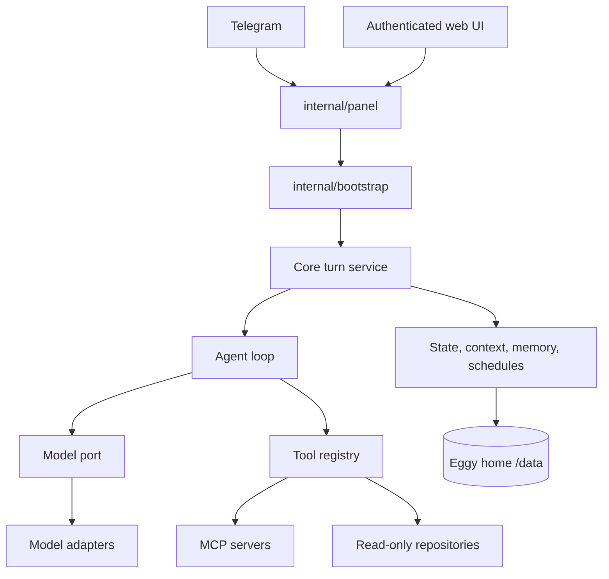

Eggy is a Go 1.26 modular monolith. Packages are separated by dependency direction, not by deployable service: one `eggyd` binary contains the HTTP surface, event loop, core services, and selected adapters.

## Request flow

`internal/bootstrap` is the composition root and event-loop owner. It constructs adapters, registers tools, and hands provider-neutral interfaces to core services. It composes and nothing else: tool definitions live with the service that owns them, and `App` retains only what a running daemon reads, not the collaborators used to assemble it.

## Package boundaries

- `internal/core` owns agent, turn, approval, and service policy.
- `internal/ports` defines narrow provider-neutral interfaces, one file per topic; `ports.go` lists which file holds which contract.
- `internal/core/services` is the base service package.
- `internal/core/services/repo` adds read-only repository and workspace inspection and may import the base package; the reverse dependency is forbidden.
- `internal/config` parses and mutates configuration.
- `internal/commands` owns the direct Telegram command surface.
- `internal/panel` owns HTTP routes and the authenticated web API.
- `internal/<family>/<provider>` holds concrete providers and infrastructure adapters, grouped by capability: `channel/`, `llm/`, `storage/`, `schedule/`, `subprocess/`, `repository/`, `auth/`, `context/`, `fsutil/`, and single-provider families `mcp`, `google`, `web/tavily`, `skills`.
- There is no `plugins/` directory; the name is reserved for owner-addable feature plugins.

The direction `config ← panel ← bootstrap` is one-way. Config and panel never import bootstrap.

## Runtime composition

Optional capabilities are absent when unconfigured. No Telegram owner means a web-only channel. Disabled MCP servers expose no remote tools. An unconfigured capability registers no tool, so its schema is not on any model call.

The agent loop validates tool input and sends only the effective tool set for that turn. Direct owner turns and scheduled turns receive different authority: unprompted turns run against a read-only allowlist and cannot reach MCP.

### One budget, not a step cap

A turn ends when the model stops calling tools. Running long does not end it: when the exchange the loop itself produced outgrows the context policy, the oldest steps are folded into a checkpoint summary the model keeps reading and the turn continues. Instructions, durable context, the request, and any owner steering are never compacted away. A 500-step guard remains only as a runaway check against a model that calls tools forever without answering. See [Long turns, steering, and stopping](/eggy/use/long-turns/).

Steering enters at the step boundary, which is also where cancellation is checked and where compaction runs — never mid-step. A steer that arrives after the last step is delivered as a turn of its own rather than dropped.

### Observability

When `tracing` is enabled, one recorder wraps the model port and the tool registry, writing a span per model call and per tool call into the same SQLite database. Nothing in the agent's own context reads a trace back. Disabled, the recorder, the wrapper, the rows, and the HTTP routes are all absent.

## Persistence

All durable artifacts resolve through `internal/home`. File-backed stores use shared atomic-write and file-lock adapters; conversation history uses embedded SQLite. This keeps deployment to one binary plus one volume.

Eggy keeps three durable forms and no more: YAML for startup configuration, Markdown for owner-facing documents (`SOUL.md`, `memories/`, `skills/`), and SQLite for everything machine-managed — conversation and thread memory, traces, runtime state and approvals, schedules, and sealed OAuth grants, all in one `eggy.db`.

## Failure

A startup that fails does not exit the process. `eggyd` supervises the daemon rather than being it, so a failed build serves the [safe-mode](/eggy/operate/safe-mode/) repair surface instead, and a repaired config is retried in the same process. The same supervisor loop backs `/restart`.

## Administration

Every configuration write goes through `internal/config` under one file lock with the same validation. Telegram and the authenticated web panel are two views onto that single authority, not two implementations of it. Writes take effect on restart, and both surfaces say so; `/restart` and the panel's Restart button share one path that re-reads the file, verifies it loads, and lets in-flight turns finish.
