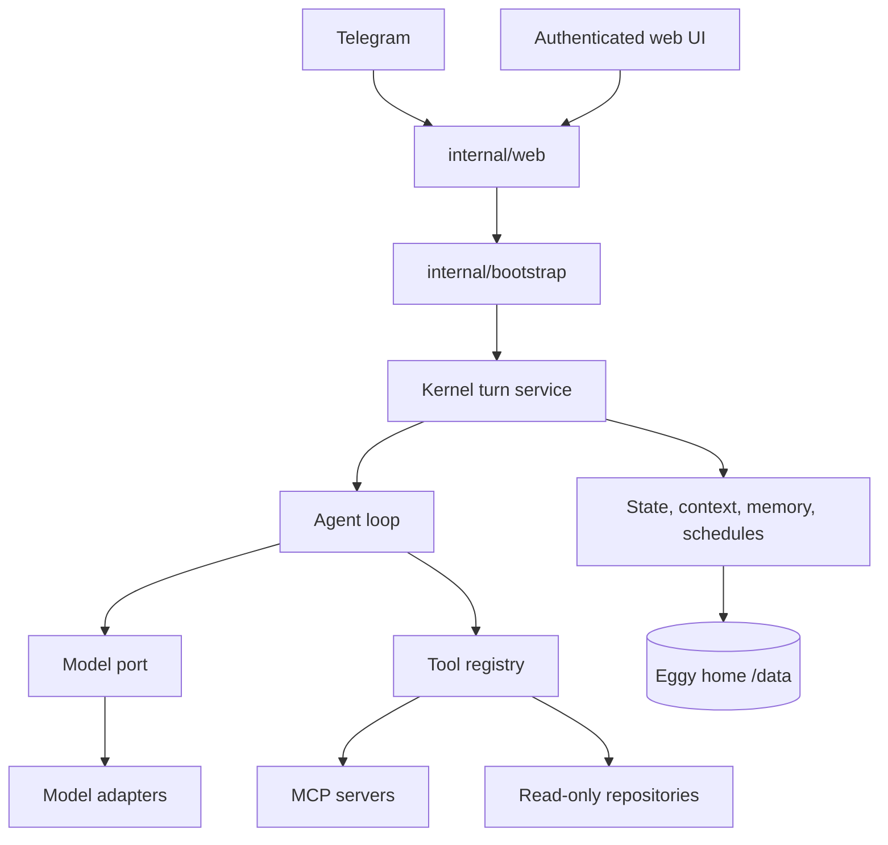

Eggy is a Go 1.26 modular monolith. Packages are separated by dependency direction, not by deployable service: one `eggyd` binary contains the HTTP surface, event loop, kernel services, and selected adapters.

## Request flow

`internal/bootstrap` is the composition root and event-loop owner. It constructs adapters, registers tools, and hands provider-neutral interfaces to kernel services.

## Package boundaries

- `internal/kernel` owns agent, turn, approval, and service policy.
- `internal/ports/ports.go` defines narrow provider-neutral interfaces.
- `internal/kernel/services` is the base service package.
- `internal/kernel/services/repo` adds read-only repository and workspace inspection and may import the base package; the reverse dependency is forbidden.
- `internal/config` parses and mutates configuration.
- `internal/commands` owns the five direct Telegram commands.
- `internal/web` owns HTTP routes and the authenticated web API.
- `plugins/` contains concrete providers and infrastructure adapters.

The direction `config ← web ← bootstrap` is one-way. Config and web never import bootstrap.

## Runtime composition

Optional capabilities are absent when unconfigured. No Telegram owner means a web-only channel. Disabled MCP servers expose no remote tools.

The agent loop validates tool input, bounds tool steps, and sends only the effective tool set for that turn. Direct owner turns and scheduled turns receive different authority.

## Persistence

All durable artifacts resolve through `internal/home`. File-backed stores use shared atomic-write and file-lock adapters; conversation history uses embedded SQLite. This keeps deployment to one binary plus one volume.
